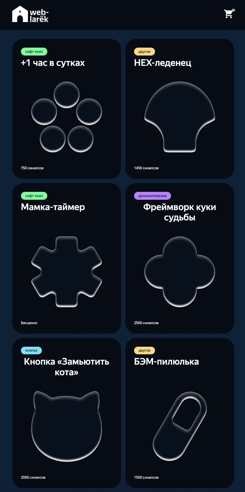
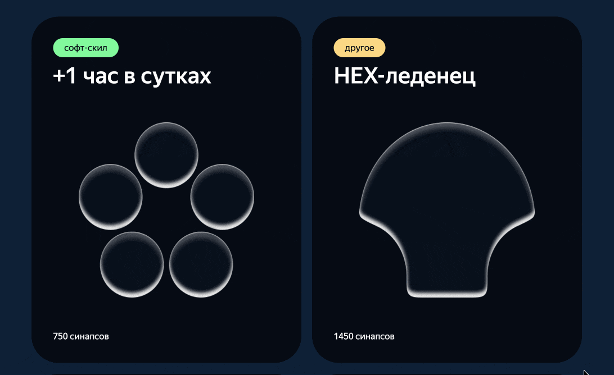
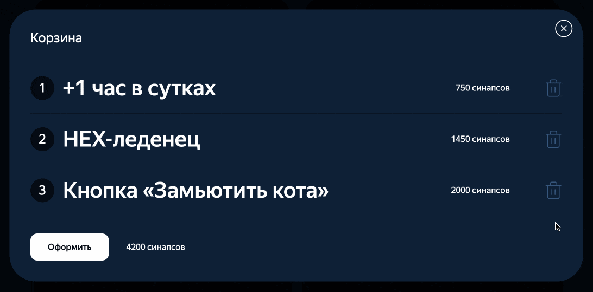
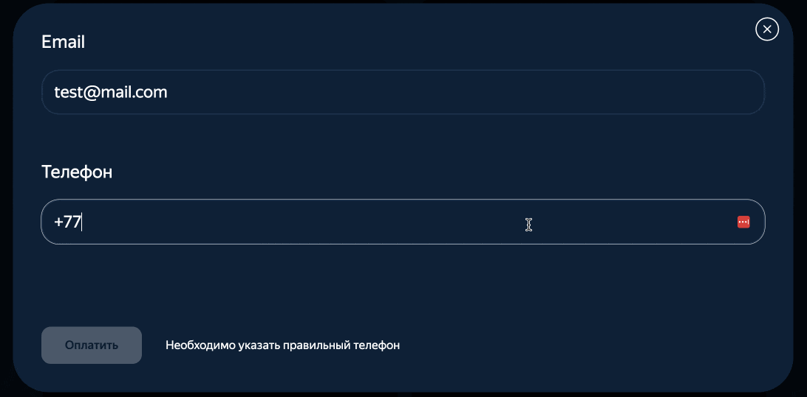

# Веб-ларек — интернет-магазин для разработчиков

«Веб-ларек» — это учебный проект, созданный в рамках курса «Фронтенд-разработчик» от «Яндекс Практикума». Здесь пользователи могут добавлять товары в корзину и оформлять заказы.

 <p align="center">
 
 </p>

 ## Технологии

<table align="center">
  <tr>
    <td align="center">
      <br/>
      <sub>HTML5</sub>
    </td>
    <td align="center">
      <br/>
      <sub>SCSS</sub>
    </td>
    <td align="center">
      <br/>
      <sub>TypeScript</sub>
    </td>
   <td align="center">
      <br/>
      <sub>Webpack</sub>
    </td>
  </tr>
</table>

## Особенности

- Возможность просматривать подробные сведения о товаре и добавлять его в корзину

 <p align="center">
 
 </p>

 - Управление товарами в корзине

 <p align="center">
 
 </p>

  - Оформление заказа с отправкой данных на сервер

 <p align="center">
 
 </p>

## Установка и запуск

Для установки и запуска проекта необходимо выполнить команды

```
npm install
npm run start
```

или

```
yarn
yarn start
```
## Сборка

```
npm run build
```

или

```
yarn build
```

## Архитектура

Проект выстроен в соответствии с шаблоном проектирования MVP (Model-View-Presenter) и разделен на три слоя: слой данных, слой представления и презентер. Классы модели данных и представления вынесены в отдельные компоненты, а логика презентера реализована в основном скрипте `index.ts`.

Также в проекте используется событийно-ориентированный подход. За его реализацию отвечают брокер событий и презентер. Для этого брокер событий добавляется в конструктор некоторых классов, чтобы генерировать события в определенных ситуациях, а презентер реагирует на них в своем коде.

### Описание данных

В проекте используются следующие типы данных и интерфейсы:

<table align="center">
  <tr>
    <th width="50%">Тип / интерфейс</th>
    <th width="50%">Описание</th>
  </tr>
  <tr>
    <td><pre><code>type ItemCategory =
  'софт-скил' |
  'другое' |
  'дополнительное' |
  'кнопка' |
  'хард-скил'</code></pre></td>
    <td>Тип для описания категории товара</td>
  </tr>
  <tr>
    <td><pre><code>type Price =
        number |
        null</code></pre></td>
    <td>Тип для описания цены товара</td>
  </tr>
  <tr>
    <td><pre><code>type Payment =
        'card' |
        'cash'</code></pre></td>
    <td>Тип для описания способа оплаты</td>
  </tr>
  <tr>
    <td><pre><code>interface IId {
    id: string;
    }</code></pre></td>
    <td>Интерфейс для описания идентификатора товара или заказа</td>
  </tr>
  <tr>
    <td><pre><code>interface IPayment {
    payment: Payment;
    }</code></pre></td>
    <td>Интерфейс для описания способа оплаты</td>
  </tr>
  <tr>
    <td><pre><code>interface ITotalAmount { 
    total: number;
    }</code></pre></td>
    <td>Интерфейс для описания суммарного числа</td>
  </tr>
  <tr>
    <td><pre><code>interface ICartCheck {
    inCart: boolean;
    }</code></pre></td>
    <td>Интерфейс для описания наличия товара в корзине</td>
  </tr>
  <tr>
    <td><pre><code>interface IShopItem extends IId {
    description: string;
    image: string;
    title: string;
    category: ItemCategory;
    price: Price;
    }</code></pre></td>
    <td>Интерфейс для описания товара</td>
  </tr>
  <tr>
    <td><pre><code>interface ICatalog {
    items: IShopItem[];
    }</code></pre></td>
    <td>Интерфейс для описания каталога товаров</td>
  </tr>
  <tr>
    <td><pre><code>interface IItemCard
    extends IShopItem,
            ICartCheck
        {
        index: number;
        }</code></pre></td>
    <td>Интерфейс для передачи данных в компонент представления, отвечающий за карточку товара</td>
  </tr>
  <tr>
    <td><pre><code>interface IUserData {
    email: string;
    phone: string;
    address: string;
    }</code></pre></td>
    <td>Интерфейс для описания данных пользователя</td>
  </tr>
  <tr>
    <td><pre><code>interface IOrderData
    extends IUserData,
            ITotalAmount
    {
    payment: Payment | undefined;
    items: string[];
    }</code></pre></td>
    <td>Интерфейс для описания данных заказа</td>
  </tr>
  <tr>
    <td><pre><code>type OrderInfo = Pick&lt;
  IOrderData,
  'payment' | 'address'
  &gt;;</code></pre></td>
    <td>Тип для передачи данных в компонент представления, отвечающий за форму заказа</td>
  </tr>
  <tr>
    <td><pre><code>type ContactInfo = Pick&lt;
  IUserData,
  'email' | 'phone'
  &gt;;</code></pre></td>
    <td>Тип для передачи данных в компонент представления, отвечающий за форму контактной информации</td>
  </tr>
   <tr>
    <td><pre><code>type OrderErrors = Partial&lt;
   Record&lt;
    keyof IOrderData,
    string
   &gt;
  &gt;;</code></pre></td>
    <td>Тип для описания ошибок при оформлении заказа</td>
  </tr>
  <tr>
    <td><pre><code>interface IOrderResult
    extends ITotalAmount,
            IId
    {}</code></pre></td>
    <td>Интерфейс для описания результата, сформированного после отправки заказа</td>
  </tr>
  <tr>
    <td><pre><code>interface IElementCollection {
    items: HTMLElement[];
    }</code></pre></td>
    <td>Интерфейс для описания коллекции однотипных HTML-элементов</td>
  </tr>
  <tr>
    <td><pre><code>interface IPage
        extends IElementCollection
    {
    cartAmount: number;
    locked: boolean;
    }</code></pre></td>
    <td>Интерфейс для передачи данных в компонент представления, отвечающий за всю страницу</td>
  </tr>
  <tr>
    <td><pre><code>interface IModalData {
    content: HTMLElement;
    }</code></pre></td>
    <td>Интерфейс для передачи данных в компонент представления, отвечающий за модальное окно</td>
  </tr>
  <tr>
    <td><pre><code>interface ICart
    extends IElementCollection,
            ITotalAmount
    {}</code></pre></td>
    <td>Интерфейс для передачи данных в компонент представления, отвечающий за корзину</td>
  </tr>
  <tr>
    <td><pre><code>interface IFormState {
    valid: boolean;
    errors: string[];
    }</code></pre></td>
    <td>Интерфейс, описывающий состояние формы, который используется для передачи данных в компонент представления, отвечающий за форму</td>
  </tr>
  <tr>
    <td><pre><code>interface IContactForm
        extends IFormState
    {
    payment: Payment;
    }</code></pre></td>
    <td>Интерфейс для передачи данных в компонент представления формы с выбором способа оплаты</td>
  </tr>
  <tr>
    <td><pre><code>interface IEvents {
  
  on&lt;T extends object&gt;(
  event: EventName,
  callback: (data: T) => void
  ): void;
  
  emit&lt;T extends object&gt;(
    event: string,
    data?: T
  ): void;
  
  trigger&lt;T extends object&gt;(
    event: string,
    context?: Partial&lt;T&gt;
  ): (data: T) => void;
}</code></pre></td>
    <td>Интерфейс для описания брокера событий</td>
  </tr>
  <tr>
    <td><pre><code>type State =
  'browsing' |
  'preview' |
  'cart' |
  'order_form' |
  'contact_form' |
  'order_success'</code></pre></td>
    <td>Тип для описания состояний приложения</td>
  </tr>
  <tr>
    <td><pre><code>type TransitionMap = Record&lt;
  State,
  Partial&lt;Record&lt;string, State&gt;&gt;
  &gt;;</code></pre></td>
    <td>Тип карты, описывающей навигацию между состояниями</td>
  </tr>
  <tr>
    <td><pre><code>type StateDataMap = {
    preview: IId;
    order_success: ITotalAmount;
    }</code></pre></td>
    <td>Карта, описывающая типы данных, которые передаются в брокер событий при переходе в определенные состояния</td>
  </tr>
  <tr>
    <td><pre><code>type StateChangedEvent = {
    [K in State]: K extends keyof StateDataMap
      ? { state: K; data: StateDataMap[K] }
      : { state: K; data?: unknown };
  }[State]</code></pre></td>
    <td>Тип для определения состояний, которым требуются данные определенного типа, перечисленных в карте StateDataMap</td>
  </tr>
</table>

### Базовые компоненты

Следующие компоненты обладают общим функционалом и используются как основа для компонентов, специфичных для данного проекта.

#### Класс `Api`

- Базовый класс для работы с API.

- Конструктор принимает аргумент `baseUrl: string`, отвечающий за основную ссылку на API, используемую для всех запросов.

##### Методы класса

- `handleResponse(response: Response): Promise<object>` — отвечает за обработку ответа от сервера, преобразовывая его в `json`, если запрос успешен

- `get(uri: string)` — отвечает за запросы с методом `GET`

- `post(uri: string, data: object, method: ApiPostMethods = 'POST')` — отвечает за запросы с методом `POST`

#### Класс `EventEmitter`

- Базовый брокер событий. Позволяет устанавливать обработчики событий и реагировать на них.

##### Методы класса

- `on<T extends object>(eventName: EventName, callback: (event: T) => void)` — позволяет установить обработчик на событие

- `emit<T extends object>(eventName: string, data?: T)` — позволяет инициировать событие с данными

#### Класс `Component<T>`

- Базовый класс, который наследуют все компоненты представления. Класс является дженериком и принимает в переменной `T` тип данных, отображаемых в компонентах представления.

- Конструктор принимает аргумент `container: HTMLElement`, отвечающий за отображение определенного HTML-элемента.

##### Методы класса

- `toggleClass(element: HTMLElement, className: string, force?: boolean)` — отвечает за переключение определенного класса у элемента

- `setText(element: HTMLElement, value: unknown)` — отвечает за установку текстового содержимого у желаемого элемента

- `setImage(element: HTMLImageElement, src: string, alt?: string)` — отвечает за установку ссылки и альтернативного текста изображения

- `render(data?: Partial<T>): HTMLElement` — отвечает за рендеринг элемента и позволяет указать полные или частичные данные определенного типа, которые требуется отобразить

### Компоненты модели данных

#### Класс `ShopModel`

- Этот класс отвечает за бизнес-логику приложения и позволяет выполнять все необходимые операции с данными.

- Конструктор принимает аргумент `events: IEvents`, отвечающий за указание брокера событий.

##### Поля класса

- `items: IShopItem[]` — массив всех предметов в каталоге

- `cart: string[]` — массив идентификаторов товаров, добавленных в корзину

- `order: IOrderData` — сведения о заказе

- `orderErrors: OrderErrors` — объект для ошибок, которые могут возникнуть при оформлении заказа

##### Методы класса

- `setItems(items: IShopItem[])` — позволяет установить весь массив товаров в каталоге

- `getItem(id: string): IShopItem` — возвращает объект товара с указанным `id`

- `addToCart(id: string)` — позволяет добавить товар в корзину

- `removeFromCart(id: string)` — удаляет товар из корзины

- `clearCart()` — удаляет все товары из корзины

- `clearOrderInfo()` — сбрасывает контактную информацию и способ оплаты в заказе

- `getCartAmount(): number` — возвращает общее количество товаров в корзине

- `getCartTotal(): number` — возвращает суммарную стоимость всех товаров в корзине

- `setOrderField<K extends keyof IOrderData>(field: K, value: IOrderData[K])` — позволяет установить значение нужного поля в объекте заказа

- `inCart(id: string): boolean` — позволяет проверить, находится ли в корзине товар с указанным `id`

- `validateOrder()` — валидирует данные пользователя, указанные при оформлении заказа

#### Класс `ShopAPI`

- Класс для работы с API магазина.

- Конструктор принимает следующие аргументы:

  - `baseUrl: string` — основная ссылка на API

  - `cdn: string` — ссылка для изображений (является полем класса)

##### Методы класса

- `getItemList(): Promise<IShopItem[]>` — позволяет получить список товаров с сервера

- `getItem(id: string): Promise<IShopItem>` — позволяет получить определенный товар с сервера

- `placeOrder(order: IOrderData): Promise<IOrderResult>` — позволяет разместить заказ на сервере

#### Класс `ShopStates`

- Класс для управления состояниями магазина.

- Конструктор принимает следующие аргументы:

  - `events: IEvents` — брокер событий

  - `transitions: TransitionMap` — карта, описывающая навигацию между состояниями

##### Поля класса

- `currentState: State` — поле, в котором хранится текущее состояние

- `previousState: State | undefined` — поле, в котором хранится предыдущее состояние

- `transitions: TransitionMap` — карта, описывающая навигацию между состояниями

##### Методы класса

- `dispatch(event: string, data?: unknown)` — реагирует на события, присутствующие в карте `transitions`, при необходимости передает нужные данные и переключается в соответствующее состояние, указанное в `transitions`

- `setState(value: State)` — позволяет указать значение поля `currentState`

- `getState()` — возвращает значение поля `currentState`

- `getPreviousState` — возвращает значение поля `previousState`

### Компоненты представления

#### Класс `Page`

- Наследует класс `Component` с переданным типом `<IPage>`.

- Отвечает за отображение каталога товаров и индикатора количества товаров в корзине.

- Использует родительский конструктор.

##### Поля класса

- `_wrapper: HTMLElement` — обертка страницы

- `_items: HTMLElement` — каталог товаров

- `_cartIcon: HTMLButtonElement` — иконка корзины

- `_cartCounter: HTMLElement` — индикатор количества товаров в корзине

##### Методы класса

- `set items(value: HTMLElement[])` — наполняет элемент каталога `_items` карточками товаров

- `set cartAmount(value: number)` — позволяет отобразить в элементе `__cartCounter` количество товаров в корзине

- `set locked(value: boolean)` — позврляет блокировать и разблокировать прокрутку страницы

#### Класс `ItemCard`

- Наследует класс `Component` с переданным типом `<IItemCard>`.

- Используется для отображения карточки товара в различных контекстах.

- Конструктор принимает аргументы `container: HTMLElement` (основной контейнер компонента) и `events: IEvents` (брокер событий).

##### Поля класса

- `_id: string` — идентификатор товара для передачи в брокер событий

- `_description: HTMLElement` — описание товара (необязательное поле)

- `_image: HTMLImageElement` — изображение товара (необязательное поле)

- `_title: HTMLElement` — название товара

- `_category: HTMLElement` — категория товара (необязательное поле)

- `_price: HTMLElement` — цена товара

- `_index: HTMLElement` — порядковый номер товара в списке (необязательное поле)

- `_button: HTMLButtonElement` — кнопка добавления / удаления товара из корзины

##### Методы класса

- `set id (value: string)` — определяет значение поля `_id`

- `set title (value: string)` — определяет текстовое содержимое элемента `_title`

- `set price (value: Price)`  — определяет текстовое содержимое элемента `_price`

- `set description (value: string)` — определяет текстовое содержимое элемента `_description`, если таковой присутствует

- `set image (value: string)` — определяет содержимое элемента `_image`, если таковой присутствует

- `set category (value: ItemCategory)` — определяет текстовое содержимое элемента `_category`, если таковой присутствует

- `set inCart(value: boolean)` — определяет текстовое содержимое кнопки `_button` в соответствии со значением

- `set index (value: number)` — определяет текстовое содержимое элемента `_index`, если таковой присутствует

- `getId(): string` — возвращает значение поля `_id`

#### Класс `Modal`

- Наследует класс `Component` с переданным типом `<IModal>`.

- Используется для отображения модального окна с любым содержимым.

- Конструктор принимает аргументы `container: HTMLElement` (основной контейнер компонента) и `events: IEvents` (брокер событий).

##### Поля класса

- `_closeButton: HTMLButtonElement` — кнопка закрытия модального окна

- `_content: HTMLElement` — содержимое модального окна

##### Методы класса

- `set content(value: HTMLElement)` — определяет содержимое элемента `_content`

- `open()` — отвечает за открытие модального окна

- `close()` — отвечает за закрытие модального окна

- `render(data: IModalData): HTMLElement` — вызывает метод класса `open()` и метод `render(data)` родителя

#### Класс `Cart`

- Наследует класс `Component` с переданным типом `<ICart>`.

- Используется для отображения списка добавленных в корзину товаров с возможностью приступить к формлению заказа.

- Конструктор принимает аргументы `container: HTMLElement` (основной контейнер компонента) и `events: IEvents` (брокер событий).

##### Поля класса

- `_items: HTMLElement` — контейнер для списка добавленных товаров

- `_button: HTMLButtonElement` — кнопка оформления заказа

- `_total: HTMLElement` — суммарная стоимость заказа

##### Методы класса

- `set items(items: HTMLElement[])` — наполняет элемент `_items` карточками товаров, а также определяет статус активности кнопки `_button` в зависимости от наличия товаров

- `set total(value: Price)` — определяет текстовое содержимое элемента `_total` 

#### Класс `Form<T>`

- Базовый класс, который наследуют все компоненты представления. Класс является дженериком и принимает в переменной `T` тип данных, используемый дочерними классами.

- Общий класс для отображения всех форм в проекте.

- Конструктор принимает аргументы `container: HTMLFormElement` (основной контейнер компонента) и `events: IEvents` (брокер событий).

##### Поля класса

- `_submit: HTMLButtonElement` — кнопка отправки формы

- `_errors: HTMLElement` — отображение ошибок при заполнении или сабмите формы

##### Методы класса

- `onInputChange(field: keyof T, value: string)` — генерирует события в случае инпута

- `set valid(data: boolean)` — изменяет статус активности кнопки в зависимости от значения

- `set errors(value: string)` — отвечает за отображение текстовое содержимое элемента `_errors`

- `render(state: Partial<T> & IFormState)` — отвечает за отображение формы в соответствии с переданными данными


#### Класс `OrderForm`

- Наследует класс `Form<OrderInfo>`.

- Используется для отображения формы оформления заказа с выбором способа оплаты.

- Использует родительский конструктор.

##### Поля класса

- `_buttons: HTMLButtonElement[]` — кнопки выбора способа оплаты.

##### Методы класса

- `set address(value: string)` — позволяет задать значение полю с именем `address`

- `set payment(value: Payment)` — определяет статус активности кнопки с атрибутом `name`, соответствующим переданному значению

#### Класс `ContactForm`

- Наследует класс `Form<ContactInfo>`.

- Используется для отображения формы с указанием контактных данных.

- Использует родительский конструктор.

##### Методы класса

- `set email(value: string)` — позволяет задать значение полю с именем `email`

- `set phone(value: string)` — позволяет задать значение полю с именем `phone`

#### Класс `OrderSuccess`

- Наследует класс `Component` с переданным типом `<ITotalAmount>`.

- Отвечает за отображение подтверждения успешной покупки.

- Конструктор принимает аргументы `container: HTMLElement` (основной контейнер компонента) и `events: IEvents` (брокер событий).

##### Поля класса

- `_spent: HTMLElement` — общая сумма заказа

- `_button: HTMLButtonElement` — кнопка подтверждения для перехода на главный экран

##### Методы класса

- `set total(value: number)` — определяет текстовое содержимое элемента `_spent`

## Задачи

В рамках этого проекта я выполнил следующие задачи.

- Спроектировал и задокументировал архитектуру, соответствующую принципам ООП.

- Типизировал данные в TypeScript, применив интерфейсы и дженерики.

- Реализовал код слоев отображения и данных.

- Реализовал модель данных и интегрировал ее с API.

- Реализовал компоненты интерфейса.

- Реализовал состоянияя экранов и организовал механизм перехода между состояниями.
